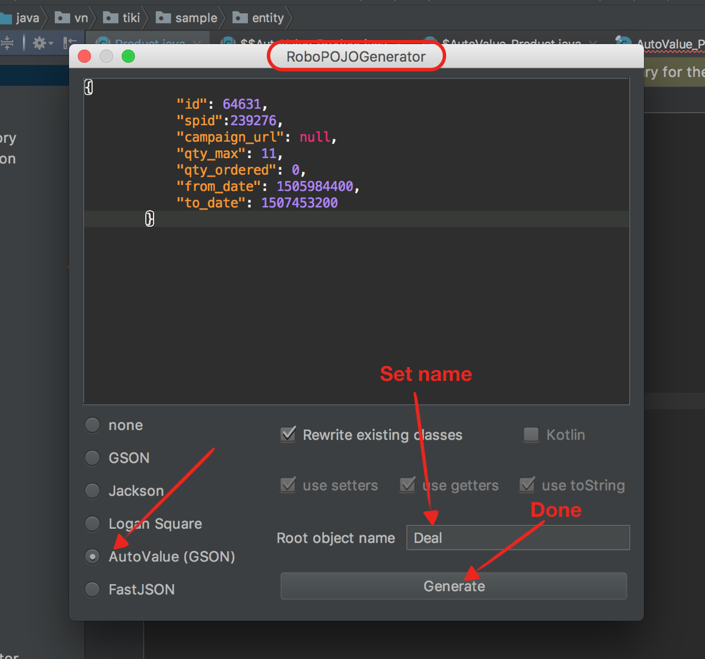

# Data 

## AutoValue + Gson

### Dependencies

#### 1. Auto value

- `compileOnly 'com.jakewharton.auto.value:auto-value-annotations:1.5'`
- `annotationProcessor 'com.google.auto.value:auto-value:1.5'`

#### 2. Auto value gson

- `compileOnly 'com.ryanharter.auto.value:auto-value-gson-annotations:0.6.0'`
- `annotationProcessor 'com.ryanharter.auto.value:auto-value-gson:0.6.0’`

### Create 
Use RoboPOJOGenerator plugin to generate AutoValue (GSON) model

 

~~~java
[Deal.java]

@AutoValue
public abstract class Deal {

  public static TypeAdapter<Deal> typeAdapter(Gson gson) {
    return new AutoValue_Deal.GsonTypeAdapter(gson);
  }

  @SerializedName("qty_max")
  public abstract int qtyMax();

  @SerializedName("from_date")
  public abstract int fromDate();

  @SerializedName("to_date")
  public abstract int toDate();

  @SerializedName("id")
  public abstract int id();

  @SerializedName("qty_ordered")
  public abstract int qtyOrdered();

  @SerializedName("spid")
  public abstract int spid();

  @SerializedName("campaign_url")
  public abstract Object campaignUrl();
}

~~~

### @Nullable or default value
Because AutoValue required all fields non-null by default but the api is not support. So, we must provide default value for `null` or `missed` fields or mark it as a @Nullable. 

#### @Nullable

~~~java
[Deal.java]

@AutoValue
public abstract class Deal {
  @SerializedName("campaign_url")
  @Nullable public abstract Object campaignUrl();
  ...
}

~~~

#### Default value
~~~gradle
[app/build.gradle]

android {
  defaultConfig {
    javaCompileOptions {
      annotationProcessorOptions {
        arguments = [
            'autovaluegson.defaultCollectionsToEmpty'        : 'true',
            'autovaluegson.mutableAdaptersWithDefaultSetters': 'true'
        ]
      }
    }
  }    
}
~~~

~~~java
[Deal.java]

@AutoValue
public abstract class Deal {

  public static TypeAdapter<Deal> typeAdapter(Gson gson) {
    return new AutoValue_Deal.GsonTypeAdapter(gson)
        .setDefaultCampaignUrl("<default url here>");
  }
  ...
}

~~~

### Register TypeAdapter for your model.
Because of your models is abstract then Gson doesn’t know how to create an instance of them. So, you have to tell Gson how to create your model instance by register generated typeAdapter

#### Register TypeAdapter

~~~java
Gson gson = new GsonBuilder()
        .registerTypeAdapter(Deal.class, Deal.typeAdapter(gson))
        .create();
~~~

#### Register TypeAdapterFactory
It’s not effective and not safe if we manual register TypeAdapter this way. Because, we have to repeat this step every time we add a new class. Fortunately, `auto-value-gson` can create a single **TypeAdapterFactory** so that you don't have to add each generated TypeAdapter to your Gson instance manually.

~~~java
@GsonTypeAdapterFactory
public abstract class MyAdapterFactory implements TypeAdapterFactory {

  // Static factory method to access the package
  // private generated implementation
  public static TypeAdapterFactory create() {
    return new AutoValueGson_MyAdapterFactory();
  }
  
}
~~~

then you just register the Factory with Gson

~~~java
Gson gson = new GsonBuilder()
    .registerTypeAdapterFactory(MyAdapterFactory.create())
    .create();
~~~

## AutoValue + Gson + Parcelable
After you configure AutoValue + Gson you can add Parcelable support very easy

### Dependencies
- `annotationProcessor 'com.ryanharter.auto.value:auto-value-parcel:0.2.5'`

### Configure

~~~java
[Deal.java]

@AutoValue
public abstract class Deal implement Parcelable {
  ...
}
~~~

